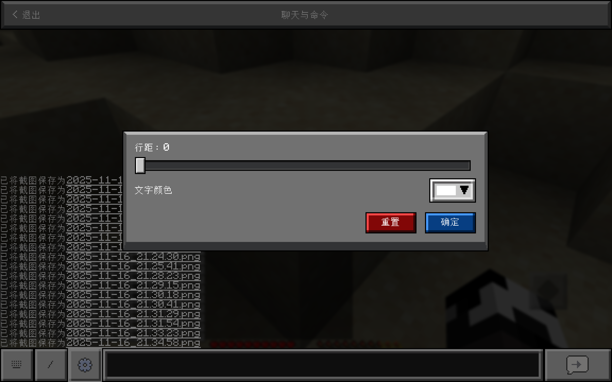

# TouchController 的聊天界面

## 说明

- 此页面使用了仿基岩版的风格
- 此页面与原版的聊天界面不是同一页面
- 此页面无法通过原版快捷键打开。只能通过设置控件[动作](../mechanism/custom-layout/custom-widget.md#动作)为“游戏操作”，`操作类型`为“聊天界面”来打开页面。

## 框架

此页面仿照基岩版聊天界面 UI，顶部为页面标题：`聊天与命令`和**退出按钮**。底部有以下几个模块：

- 弹出键盘：点击一下可以选中输入框，进而自动弹出键盘（参见[输入适配](../mechanism/input-support.md)）。再次点击取消选中输入框，此时键盘应自动收起。
- 快捷指令：目前暂未实现快捷指令功能，敬请期待。
- 设置按钮：点击后弹出弹窗，可以设置行距和文本颜色。
- 输入框：可在此输入消息。
- 发送按钮：点击后发送输入框中的消息。

