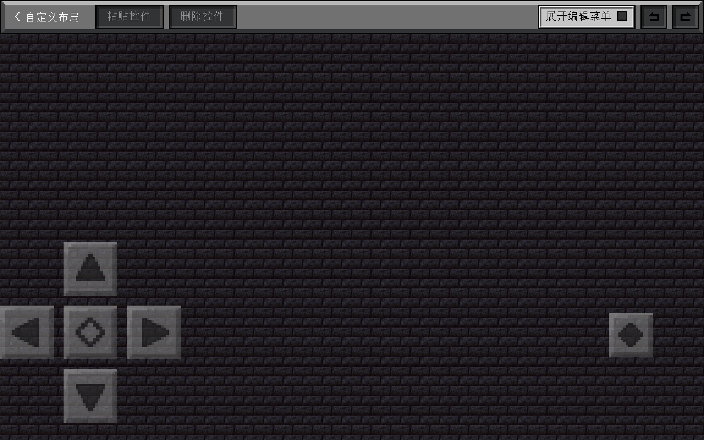
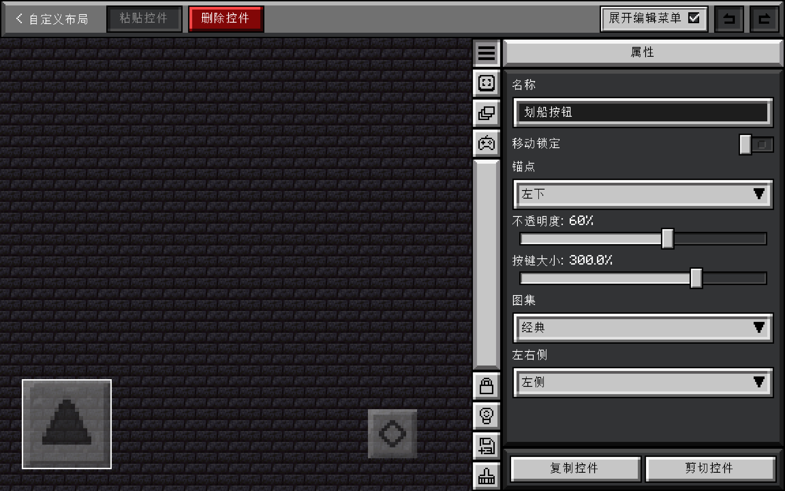
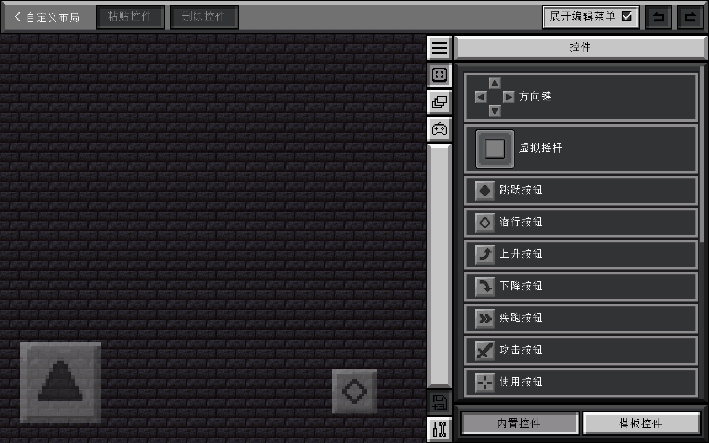
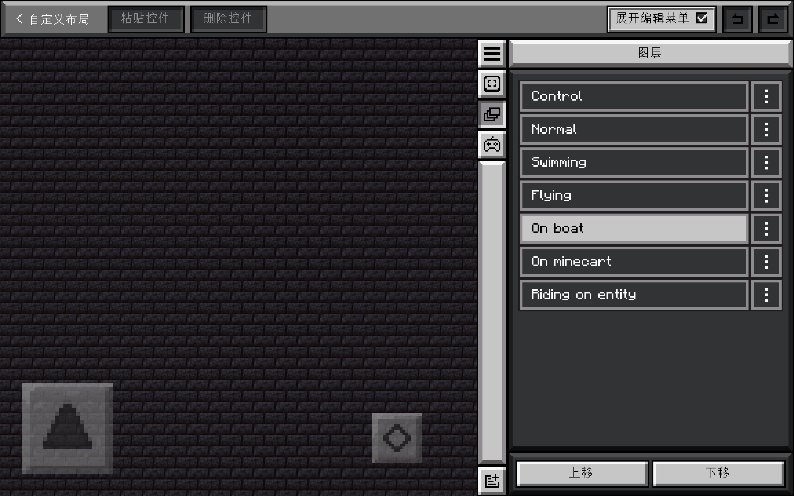
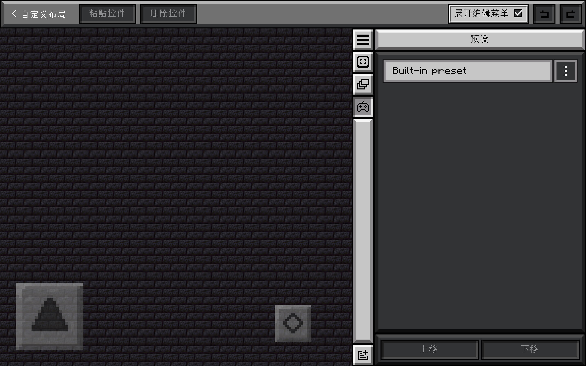

# 子页面：自定义布局

- 相关页面：[图层系统](../../../mechanism/custom-layout/layer-system.md)、[预设系统](../../../mechanism/custom-layout/preset-system.md)
- 这个页面可以自定义控件的布局
- 参见：[自定义布局的特性](../../../mechanism/custom-layout/custom-layout.md)

## 页面结构

### 顶栏

#### 返回按钮

- 参见：[返回](../config-screen.md#返回)

#### 粘贴控件

- 将剪贴板中的控件粘贴到当前图层
- 如果剪贴板没有控件，按钮会显示为禁用状态
- 粘贴后控件会保留原来的位置和属性

#### 删除控件

- 删除当前选中的控件
- 如果没有选中控件，按钮会显示为禁用状态

#### 展开编辑菜单

- 点击可以显示或隐藏边栏

#### 撤销和重做

- 有两个按钮，分别是撤销上一次操作和重做上一次操作
- 如果没有操作，按钮会显示为禁用状态

### 边栏

#### 属性

此标签页的工具栏按钮为：

- 锁定：全局锁定控件移动
- 高亮：高亮全部控件
- 保存：将当前控件储存为模板
- 格式刷：开发中

此标签页的主体为从上至下排列的一系列选项：

- 名称：一个文本框，可以进行重命名。
- 移动锁定：可以锁定当前控件。
- 锚点：参见[锚点机制](../../../mechanism/anchor-mechanism.md)
- 不透明度：一个滑杆
- 滑动触发：按下一个启用了滑动触发的控件，手指滑动到另一个启用了滑动触发控件即可触发此控件。
- 捕获触发：按下后，手指移开仍继续触发。
- 视角跟随：按下后手指可以移动视角。

这些选项的下方为[自定义控件](../../../mechanism/custom-layout/custom-widget.md)的相关设置。

此标签页的底部有两个按钮，分别为复制控件和剪切控件。

#### 控件

此标签页的工具栏按钮为：

- 保存：将当前控件储存为模板
- 设置：新控件默认不透明度、贴图风格

此标签页拥有两个子标签页，可以在页面底部切换，分别为：

- 内置控件：TouchController 预置的控件，可以直接使用（在内置控件的最后，有一个作为模板的空白自定义控件）。
- 模板控件：通过上述的保存按钮储存的控件，用于复用自定义后的控件。

#### 图层

此标签页的工具栏按钮为：

- 添加图层：点击后跳转到[图层编辑](../../../mechanism/custom-layout/layer-system.md#图层编辑)页面，可以编辑图层条件、名称并添加一个空图层。

此标签页的主体为从上至下排列的一系列图层，下方有上移和下移按钮，用于排序图层。

点击图层右边的三个点，可以删除、复制、编辑图层，点击编辑按钮后会跳转到[图层编辑](../../../mechanism/custom-layout/layer-system.md#图层编辑)页面。

关于图层的详细机制，请查看[图层系统](../../../mechanism/custom-layout/layer-system.md)。

#### 预设

此标签页的工具栏按钮为：

- 添加预设：点击后弹出窗口，可以选择从模板创建一个预设或者直接创建一个新的预设

此标签页的主体为从上至下排列的预设列表，下方有上移和下移按钮，用于排序预设。

点击预设右边的三个点，可以删除、复制、编辑预设，可以查看预设文件路径，可以在此调整预设设置。

关于预设的详细机制，请查看[预设系统](../../../mechanism/custom-layout/preset-system.md)。

