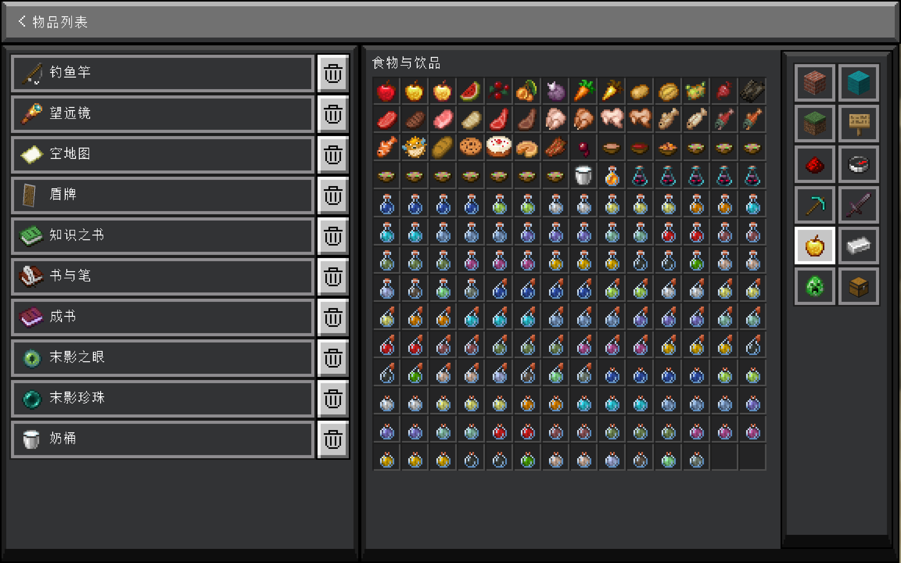

# 子页面：物品列表

- 此页面只拥有[返回按钮](../config-screen.md#返回)
- 这个页面用来配置物品列表

## 描述

这个页面分为两部分，左半部分是已添加的物品。每一条包含物品图标和物品名称。右半部分是物品表，可以在进入时选择模式（也可以在选择物品后按下 `Escape` 来重新选择）：默认物品表、原版物品栏、JEI（REI 等）物品表 **（JEI、REI 等物品表正在开发中）**。

默认物品表和 JEI（REI 等）物品表的显示模式一致，所有物品的图标以从左往右、从上往下的顺序排列，在物品表的上方有一个搜索框，可以通过物品名称搜索物品。

原版物品栏对应 Minecraft 中的创造模式物品栏，原版物品栏的物品表以及标签与跟创造模式物品栏一致，模组添加的标签页也能在此显示。指南针图标的标签页以及箱子图标的标签页是两个特殊的标签页；指南针图标的标签页包含所有物品，可以通过物品名称搜索物品；箱子图标的标签页就是生存模式物品栏，即玩家背包。

