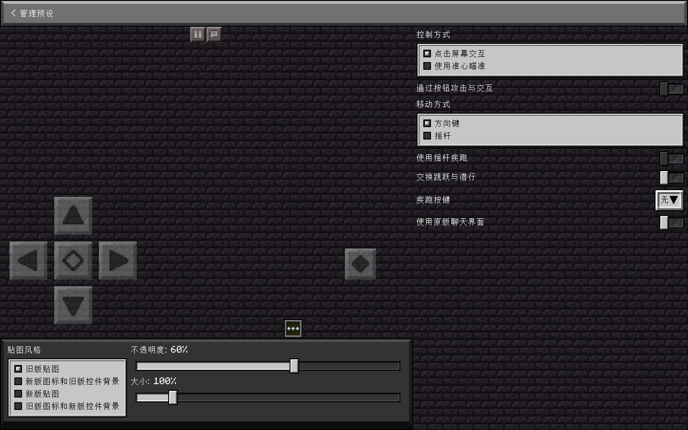

# 子页面：管理预设

- 此页面只拥有[返回按钮](../config-screen.md#返回)
- 这个页面可以用来配置由开发团队提供的控件预设。
- 参见：[管理预设的特性](../../../mechanism/manage-widget-preset.md)

## 选项

### 样式

#### 贴图风格

- 类型：单选列表
- 选项：
  - 旧版贴图
  - 旧版图标和新版控件背景
  - 新版贴图
  - 新版图标和旧版控件背景
- 参见[控件样式](../../../widget/widget-style.md)

#### 不透明度

- 类型：滑杆
- 默认值：60%
- 这个选项用来调整所有控件的不透明度，但物品栏按钮不受此选项影响。

#### 大小

- 类型：滑杆
- 默认值：100
- 这个选项用来调整所有控件的大小，但物品栏按钮不受此选项影响。

### 布局

#### 控制方式

- 类型：单选列表
- 选项：
  - 点击屏幕交互
  - 使用准星瞄准
- 即：是否启用“分离控制”

#### 通过按钮攻击与交互

- 类型：选项
- 前置：控制方式为“使用准星瞄准”
- 默认值：启用
- 启用后将关闭触摸手势，仅使用按钮攻击与交互。

#### 移动方式

- 类型：单选列表
- 选项：
  - 方向键
  - 摇杆
- 此选项会导致下方选项产生一些差异

#### 使用摇杆疾跑

- 类型：选项
- 前置：移动方式为“摇杆”
- 默认值：禁用
- 摇杆推到 110% 后触发疾跑。

#### 交换跳跃与潜行

- 类型：选项
- 前置：
  - 禁用“通过按钮攻击与交互”
  - 移动方式为“方向键”
- 默认值：禁用

#### 疾跑按键

- 类型：下拉菜单
- 选项：
  - 无
  - 右上角
  - 右侧

#### 使用原版聊天界面

- 类型：选项
- 默认值：禁用
- 控制聊天按钮是否打开 TouchController 的[聊天界面](../../chat-screen.md)

