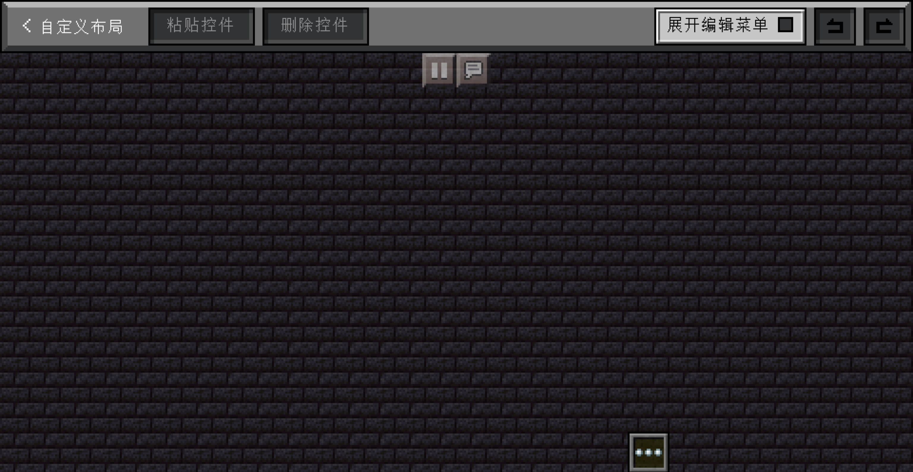
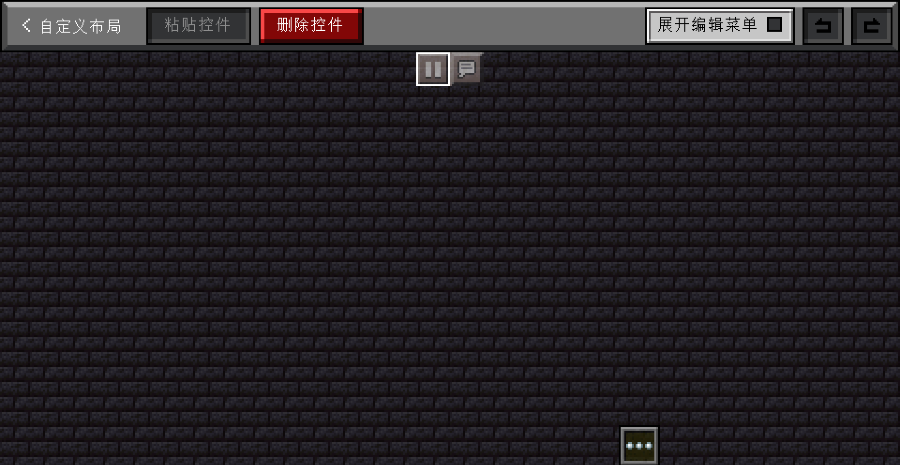
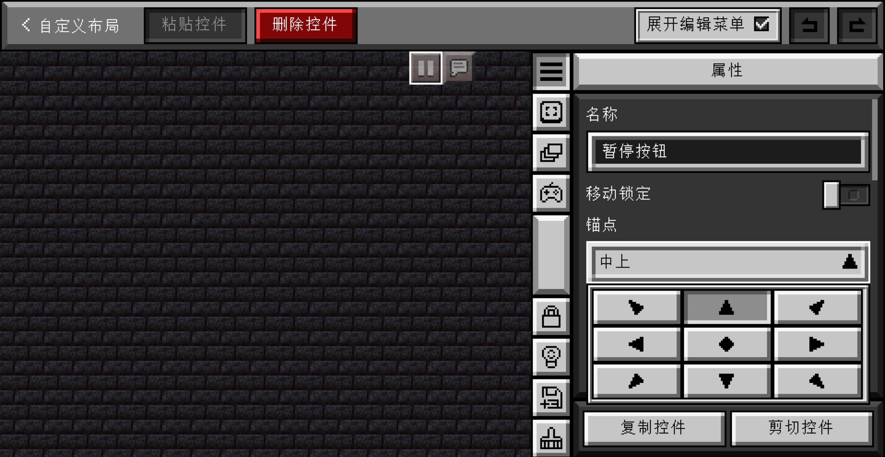
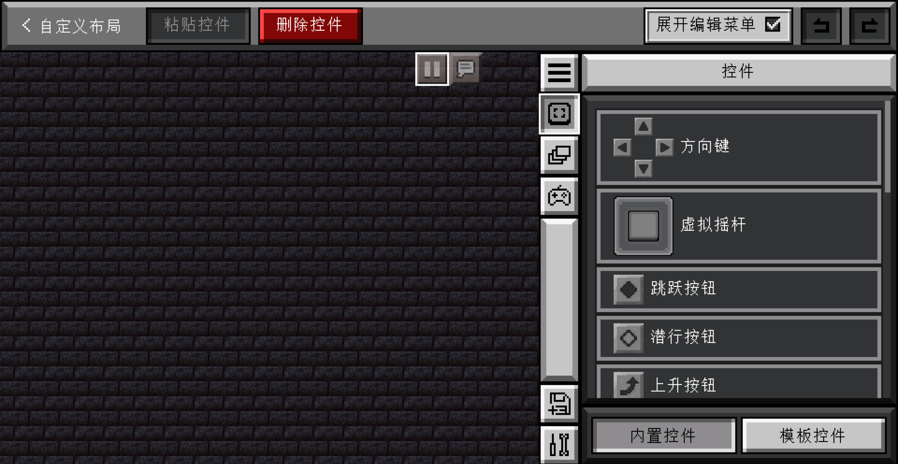
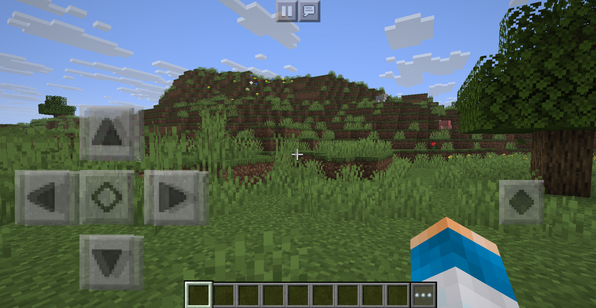
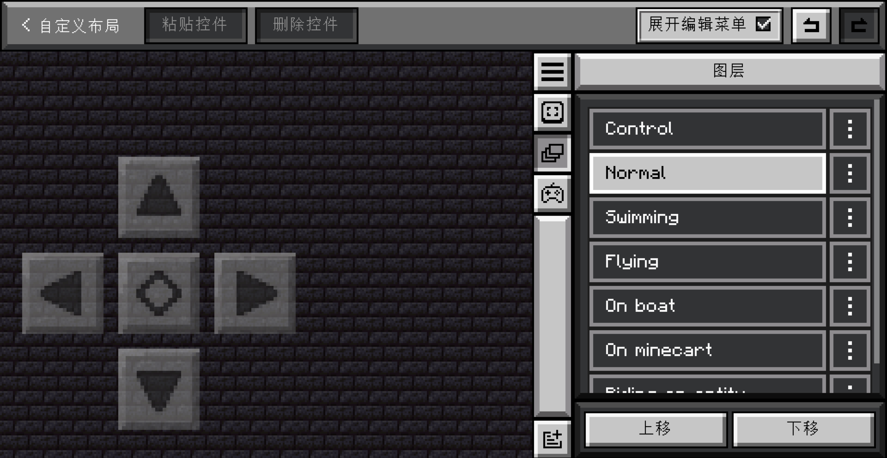
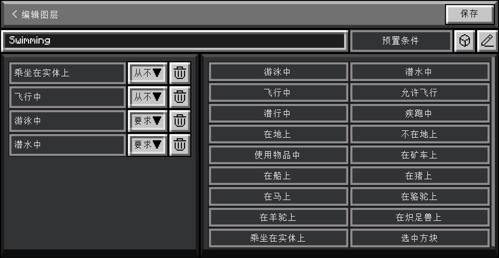

# 自定义布局基础

TouchController 是一款有着图层、自定义控件等强大自定义功能的触控模组。对于大部分玩家来说，可能自带的[控件预设](../gui/config-screen/sub-pages/manage-widget-preset.md)功能已经足够，不过当你想修改一下控件的位置，或者是添加一下新的控件时，打开[自定义模式](../gui/config-screen/sub-pages/custom-widget-layout.md)后却不知所措。没关系！这篇文章就是给你这样的人的。读完这篇文章，你将会了解：

- TouchController 自定义布局的基本原理
- TouchController 组件的布局方式
- TouchController 的自带控件
- TouchController 的图层系统
- TouchController 的图层条件

## TouchController 自定义布局的基本原理

可能大部分人对于自定义布局的概念就是把能够把界面控件放在屏幕上自己想要的地方。不过 TouchController 做的更多！如果你有玩过基岩版的 Minecraft，那么你就知道界面上的按钮是会根据玩家状态不同变更的，例如：

- 飞行和游泳时，跳跃键会变成上升和下降键
- 骑乘时，会出现离开载具的按键
- 等等……

TouchController 不像部分启动器自带的按键布局，由于它是集成在游戏内的，因此它可以根据玩家的状态去自动修改界面上的控件。不过相对于基岩版，TouchController 通过图层系统，提供了远比基岩版强大的自定义功能，你可以非常自由地定义界面上的控件什么时候显示，什么时候隐藏。

除了控件的位置和显示隐藏，TouchController 还完全支持自定义控件的行为与样式。你可以自由定义一个控件的外观和文本，并且修改按下、松开等事件时的行为。

再多说一句，实际上 TouchController 自带的控件预设本质上就是自带的自定义布局，它们的工作方式与你自己的自定义布局完全一样。这说明你完全可以自己从头开始搓一个和自带的预设一样的自定义布局。

## TouchController 组件的布局方式

说了这么多，那么我们从最基本的组件开始吧！第一次打开 TouchController 的自定义模式后，模组会把你当前的控件预设复制一份到你的自定义布局中，因此你应该会看到这样的界面：

界面分为两部分：顶栏和图层编辑界面。顶栏上的按钮功能如下：

- 返回按钮：就是返回上一层界面
- 粘贴控件：把之前复制的控件粘贴到当前图层中
- 删除控件：删除当前选中的控件
- 展开编辑菜单：显示编辑侧栏，这个侧栏中包含了很多重要的功能，后面会详细解释
- 撤销和还原：撤销和还原你的操作

在图层编辑界面，你就可以拖曳控件来移动控件的位置，或者单击控件以选中它。选中后，控件的边缘会有白框，如下：

再打开侧栏，我们就可以看到很多功能了。在控件属性里我们可以看到锚点的选项，具体如下：

锚点主要影响屏幕大小变化时控件的位置。例如，锚点在右下角时，如果你放大或者缩小游戏窗口，控件相对于屏幕右下角的位置不会改变。举个例子：基岩版的移动控制在左下角，因此你要模仿的话，锚点就应该在左下角，这样游戏界面改变时，移动控制就仍在左下角。再例如说，暂停按钮和聊天按钮都在屏幕中上方，因此它们的锚点就该在中上方，这样不论游戏界面大小怎么改变，它们都固定在屏幕中上方。如何确定锚点的基本思路就是：控件应该在屏幕上的哪个方向（例如右上角），那么锚点就应该设置为这个方向。

说了锚点，接下来就是控件的定位方式了。TouchControlle 采用锚点+绝对定位的方式，也就是屏幕上控件的位置先由锚点决定，然后实际位置是锚点位置加上一段可以通过拖曳来改变的偏移量。例如如果锚点在右下角，偏移量是 (10, 10)，那么它的位置就是屏幕右下角往坐上 XY 走 10 个单位的位置。

## TouchController 的自带控件

如果编辑现有的控件很难满足你的需求，那么我们就尝试加入一些新的控件到布局内吧！整体过程非常简单：打开编辑菜单侧栏，按下第二个按钮，就可以打开控件菜单，具体如图：

选中一个控件后，它就出现在界面编辑中了，并且返回游戏界面时也可以看到这个新加入的控件。恭喜你学会了图层的基本编辑！

## TouchController 的图层系统

如果在上一步你加入了方向键或者虚拟摇杆，你就会发现实际游戏内你加的控件和原有的控件叠在了一起：

这不是 bug，而是一个特性！实际上 TouchController 的布局由若干个图层组成，每个图层都可以独立编辑，有着独立的图层条件。如果你用过 Photoshop、GIMP 等图片编辑软件，那么你对图层应该不会陌生。如果你没用过，那么简单介绍图层机制就是把整个屏幕上的东西分为几层，每层都有可以独立显示，例如：

- 控制图层：屏幕上总是会显示的东西，例如暂停键、聊天键
- 普通层：玩家普通在地上走路时的界面，包含方向键、跳跃键
- 游泳层：玩家在游泳时的界面，包含方向键、上升下降键
- 还有很多图层……

实际游玩时，TouchController 会根据每个图层设置的图层条件，把它们叠加在一起，从而得到你最终看到的界面。你刚才一直在编辑控制图层，所以你无法看到普通层和游泳层等其它图层的内容，而且由于图层叠加的特性，你刚才加入的控件就会和普通层等图层的内容重叠在一起。

那么怎么切换图层呢？其实就在控件按钮的下面就是图层按钮。点下图层按钮，你就可以看到所有的图层，具体如下：

每个图层右侧有一个菜单，允许你编辑名称和图层条件，并且复制或者删除。在侧栏的底下，你还可以看到新建图层、上移下移三个按钮。点击图层列表中的图层，你就可以切换当前的图层了。所以刚才如果要编辑方向键或者虚拟摇杆，你应该在普通层去进行操作，而不是在默认的控制图层。

## TouchController 的图层条件

创建图层或者编辑图层时，你就会看到这样的界面：

第一眼看这个界面东西非常多，我们来慢慢讲解：

最顶上一条的顶栏就是返回和保存，这个我们就不用讲解了。顶栏下面还有一栏，左边是图层名称，右边是图层条件选择。再往下左右分为图层条件列表和图层条件选择两块。

图层条件列表中包含若干个图层条件。每个图层条件都可以选择以下三种，具体的意义如下：

- 从不：满足这个图层条件时，图层永远不显示
- 必须：不满足这个图层条件时，图层永远不显示
- 要求：必须有一个设置为“要求”的图层条件满足时，图层才会显示

例如上面图片中的图层条件，可以理解为如下：

- 第一条为“游泳中”和“从不”，那么玩家处于游泳状态时，这个图层就不会显示。
- 第二条为“飞行中”和“从不”，那么玩家处于飞行状态时，这个图层就不会显示。
- 第三条为“乘坐在实体上”和“从不”，那么玩家乘坐在实体上时，这个图层就不会显示。

再拿游泳图层举例：

- 第一条为“乘坐在实体上”和“从不”，那么玩家乘坐在实体上时，这个图层就不会显示。
- 第二条为“飞行中”和“从不”，那么玩家处于飞行状态时，这个图层就不会显示。
- 第三条为“游泳中”和“要求”，第四条为“潜水中”和“要求”，那么玩家处在游泳或者潜水两者其一时，同时满足上面“乘坐在实体上”和“飞行中”不触发的两个条件时，这个图层才会显示。

当然，图层条件列表也可以为空，代表一直显示。

## 结语

这就是 TouchController 自定义布局的基础知识了。希望通过这篇文章，你可以掌握 TouchController 布局的基本使用。
