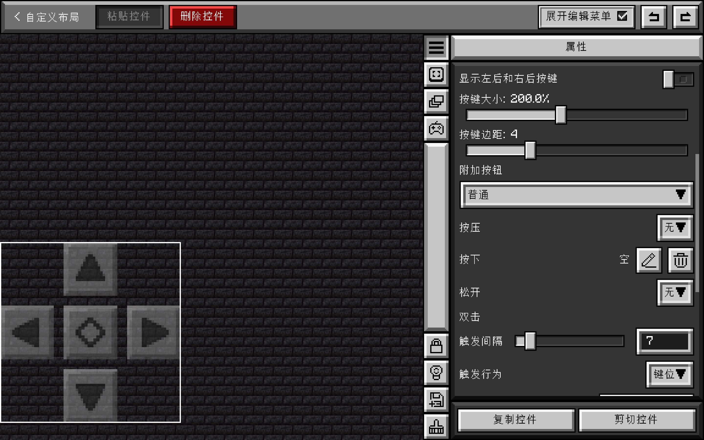

# TouchController 中的游戏内控件

## 相关页面

- 您可以在[自定义布局](../gui/config-screen/sub-pages/custom-widget-layout.md)中查看如何管理控件。
- 您可以在[控件样式](./widget-style.md)中查看控件使用什么贴图。

## 内置控件

TouchController 的内置控件主要是基于[自定义控件](../mechanism/custom-layout/custom-widget.md)实现的，但也有一些控件无法通过标准自定义控件实现，它们有一些不同于自定义控件的设置。通过自定义控件实现的内置控件在此不再赘述（您可以直接查看其属性以了解其特性），我们主要介绍无法通过标准自定义控件实现的内置控件：

### 方向键

方向键除了可以调整大小、调整图集外，还可以有以下设置：

- 显示左后和右后按键：是否显示左后和右后的斜向按键贴图
- 边距：方向键各个按钮之间的间距
- 中心按钮（游戏内名称：附加按钮）：中心按钮可以独立调整大小、激活贴图，并且包含无、普通、滑动无锁定、滑动锁定四种类型：
  - 无：不显示中心按钮
  - 普通：[操作](../mechanism/custom-layout/custom-widget.md#操作)与普通控件拥有相同的设置
  - 滑动无锁定：手指滑过中心按钮后触发，[操作](../mechanism/custom-layout/custom-widget.md#操作)与普通控件拥有相同的设置
  - 滑动锁定：手指滑过中心按钮后触发一次，[操作](../mechanism/custom-layout/custom-widget.md#操作)只能设为绑定键位

### 虚拟摇杆

虚拟摇杆除了可以修改图集外，还可以分别调整背景和手柄的大小，同时拥有两个选项：

- 触发疾跑：摇杆推到 110% 后触发疾跑
- 激活时提高不透明度：手指移动摇杆时，摇杆提高不透明度

### 划船按钮

划船按钮较为特殊，就像坦克一样，按住左边的按钮可以右转，按住右边的按钮可以左转，按住两个按钮可以同时前进。

划船按钮除了可以调整大小、调整图集外，还可以设置当前按钮为左侧按钮或右侧按钮。

